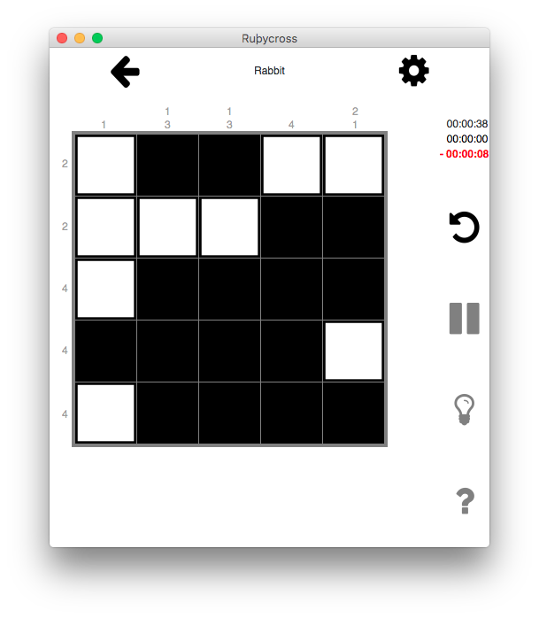

# Ruþycross


**Ruþycross logo :**

 

**Application screen :**

 


## Current project status

[](https://travis-ci.com/valentinp72/picross)
[](https://codeclimate.com/repos/5a624aeae596c21745002d54/maintainability)
[](https://codeclimate.com/repos/5a624aeae596c21745002d54/test_coverage)

## Installation 

#### Required
- `ruby 2.2.2` minimum
- `GTK 3.22.0` minimum (not the Ruby gem, but the [compiled toolkit](https://www.gtk.org/))
- Linux or macOS (not tested on Windows)

```shell
git clone https://github.com/valentinp72/picross.git
# using SSH:
# git clone git@github.com:valentinp72/picross.git

cd picross
gem install bundle
bundle install
```

### macOS installation
- Download the last release [here](https://github.com/valentinp72/picross/releases).
- Open the disk image (.dmg)
- Move the Rubycross application to the Application folder
- You can now play the game (available in the launchpad)

**Known bug**: the application crashes if there is a space character in the path to the application file. [see here](https://github.com/valentinp72/picross/issues/28)

## Documentation
[**Link to generated RDoc**](https://picross.vlntn.pw/doc/)

```
rake doc
```

## Unit tests and tests coverage
```shell
rake tests
```
